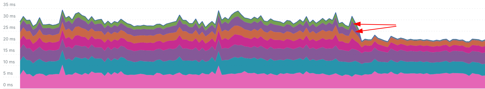

```bash
ab test with concurrency 100 and 1000 requests gives depending on a moon phase 5.2-6.4k RPS on my machine:

```bash
>> ab -c 100 -n 1000 http://127.0.0.1:8000/

Concurrency Level:      100
Time taken for tests:   0.167 seconds
Complete requests:      1000
Failed requests:        0
Non-2xx responses:      1000
Total transferred:      173000 bytes
HTML transferred:       22000 bytes
Requests per second:    5994.77 [#/sec] (mean)
Time per request:       16.681 [ms] (mean)
Time per request:       0.167 [ms] (mean, across all concurrent requests)
Transfer rate:          1012.79 [Kbytes/sec] received


```

Now let's add the very basic BaseHTTPMiddleware that is doing nothing to our application:

```python
from urllib.request import Request
from fastapi import FastAPI
from starlette.middleware.base import BaseHTTPMiddleware

app = FastAPI()


class HTTPMiddleware:
    async def __call__(self, request: Request, call_next):
        return await call_next(request)


app.add_middleware(BaseHTTPMiddleware, dispatch=HTTPMiddleware())


@app.get("/")
def read_root():
    return {"Hello": "World"}
```

Surprisingly, impact on RPS of such a simple middleware is quite visible:

```bash
>> ab -c 100 -n 1000 "http://127.0.0.1:8000/"

Concurrency Level:      100
Time taken for tests:   0.295 seconds
Complete requests:      1000
Failed requests:        0
Non-2xx responses:      1000
Total transferred:      173000 bytes
HTML transferred:       22000 bytes
Requests per second:    3387.20 [#/sec] (mean)
Time per request:       29.523 [ms] (mean)
Time per request:       0.295 [ms] (mean, across all concurrent requests)
Transfer rate:          572.25 [Kbytes/sec] received

``` 

Now, let's stack up the same middleware a few times and see how it affects RPS.

```python
...

for _ in range(5):
    app.add_middleware(BaseHTTPMiddleware, dispatch=HTTPMiddleware())

...
```

The impact becomes quite significant RPS drops by an order of magnitude, comparing to single middleware not talking
to no middleware case:

```bash
>> ab -c 100 -n 1000 "http://127.0.0.1:8000/"

Concurrency Level:      100
Time taken for tests:   1.500 seconds
Complete requests:      1000
Failed requests:        0
Total transferred:      161000 bytes
HTML transferred:       17000 bytes
Requests per second:    666.71 [#/sec] (mean)
Time per request:       149.990 [ms] (mean)
Time per request:       1.500 [ms] (mean, across all concurrent requests)
Transfer rate:          104.82 [Kbytes/sec] received

```

Isn't is wierd? Our middleware is doing nothing but overhead of BaseHTTPMiddleware is very real.
Ok, let's try to do the same with ASGIMiddleware:

```python
from starlette.types import ASGIApp, Send, Scope, Receive


class ASGIMiddleware:
    def __init__(self, app: ASGIApp):
        self.app = app

    async def __call__(self, scope: Scope, receive: Receive, send: Send):
        await self.app(scope, receive, send)


app.add_middleware(ASGIMiddleware)
```

Simple ASGI Middleware also has an impact on RPS. It looks smaller that impact
from BaseHTTPMiddleware, but that might be an outlier:

```bash
Concurrency Level:      100
Time taken for tests:   0.243 seconds
Complete requests:      1000
Failed requests:        0
Total transferred:      161000 bytes
HTML transferred:       17000 bytes
Requests per second:    4112.84 [#/sec] (mean)
Time per request:       24.314 [ms] (mean)
Time per request:       0.243 [ms] (mean, across all concurrent requests)
Transfer rate:          646.65 [Kbytes/sec] received


```

Ok, let's see how stack-ing up the ASGI middlewares impacts RPS?

```python
for _ in range(5):
    app.add_middleware(ASGIMiddleware)
```

Well, that's interesting. Stacking up 5 ASGI middlewares has almost no impact on RPS:

```bash
Concurrency Level:      100
Time taken for tests:   0.246 seconds
Complete requests:      1000
Failed requests:        0
Total transferred:      161000 bytes
HTML transferred:       17000 bytes
Requests per second:    4059.46 [#/sec] (mean)
Time per request:       24.634 [ms] (mean)
Time per request:       0.246 [ms] (mean, across all concurrent requests)
Transfer rate:          638.26 [Kbytes/sec] received
```

## Diving deeper

So far our tests were very synthetic. Let's try to make them more realistic by adding some logic to our middlewares.
In asynchronous application it's very important to avoid synchronous calls that block the entire event loop and may
have dramatic performance impact, but some are unavoidable - like logging
(unless you go really serious and offload logging to a separate thread).

In out first dive, let's add some massive blocking call out our middlewares:

```python
# BaseHTTPMiddleware
class HTTPMiddleware:
    async def __call__(self, request: Request, call_next):
        with open('/tmp/middleware.log', 'a') as f:
            f.write('HTTPMiddleware\n' * 1000)
        return await call_next(request)


for _ in range(5):
    app.add_middleware(BaseHTTPMiddleware, dispatch=HTTPMiddleware())

# ASGIMiddleware

```

ASGIMiddleware seems to be three times faster than BaseHTTPMiddleware:

```bash
# BaseHTTPMiddleware
Concurrency Level:      100
Time taken for tests:   1.871 seconds
Complete requests:      1000
Failed requests:        0
Total transferred:      161000 bytes
HTML transferred:       17000 bytes
Requests per second:    534.44 [#/sec] (mean)
Time per request:       187.111 [ms] (mean)
Time per request:       1.871 [ms] (mean, across all concurrent requests)
Transfer rate:          84.03 [Kbytes/sec] received


# ASGIMiddleware
Concurrency Level:      100
Time taken for tests:   0.635 seconds
Complete requests:      1000
Failed requests:        0
Total transferred:      161000 bytes
HTML transferred:       17000 bytes
Requests per second:    1575.94 [#/sec] (mean)
Time per request:       63.454 [ms] (mean)
Time per request:       0.635 [ms] (mean, across all concurrent requests)
Transfer rate:          247.78 [Kbytes/sec] received


```

Dive 2: let's add some async calls to our middlewares:

```python
class HTTPMiddleware:
    async def __call__(self, request: Request, call_next):
        await asyncio.sleep(0.01)
        return await call_next(request)


class ASGIMiddleware:
    def __init__(self, app: ASGIApp):
        self.app = app

    async def __call__(self, scope: Scope, receive: Receive, send: Send):
        await asyncio.sleep(0.01)
        await self.app(scope, receive, send)

```

ASGIMiddleware still faster but to a lesser extent:

```bash
# BaseHTTPMiddleware
Concurrency Level:      100
Time taken for tests:   1.621 seconds
Complete requests:      1000
Failed requests:        0
Total transferred:      161000 bytes
HTML transferred:       17000 bytes
Requests per second:    617.09 [#/sec] (mean)
Time per request:       162.051 [ms] (mean)
Time per request:       1.621 [ms] (mean, across all concurrent requests)
Transfer rate:          97.02 [Kbytes/sec] received

# ASGIMiddleware
Concurrency Level:      100
Time taken for tests:   0.771 seconds
Complete requests:      1000
Failed requests:        0
Total transferred:      161000 bytes
HTML transferred:       17000 bytes
Requests per second:    1297.82 [#/sec] (mean)
Time per request:       77.052 [ms] (mean)
Time per request:       0.771 [ms] (mean, across all concurrent requests)
Transfer rate:          204.05 [Kbytes/sec] received


```

```bash

# BaseHTTPMiddleware
Concurrency Level:      100
Time taken for tests:   14.220 seconds
Complete requests:      10000
Failed requests:        0
Total transferred:      1610000 bytes
HTML transferred:       170000 bytes
Requests per second:    703.25 [#/sec] (mean)
Time per request:       142.198 [ms] (mean)
Time per request:       1.422 [ms] (mean, across all concurrent requests)
Transfer rate:          110.57 [Kbytes/sec] received

Concurrency Level:      20
Time taken for tests:   184.884 seconds
Complete requests:      50000
Failed requests:        0
Total transferred:      8050000 bytes
HTML transferred:       850000 bytes
Requests per second:    270.44 [#/sec] (mean)
Time per request:       73.953 [ms] (mean)
Time per request:       3.698 [ms] (mean, across all concurrent requests)
Transfer rate:          42.52 [Kbytes/sec] received


# ASGIMiddleware

Concurrency Level:      100
Time taken for tests:   7.144 seconds
Complete requests:      10000
Failed requests:        0
Total transferred:      1610000 bytes
HTML transferred:       170000 bytes
Requests per second:    1399.68 [#/sec] (mean)
Time per request:       71.445 [ms] (mean)
Time per request:       0.714 [ms] (mean, across all concurrent requests)
Transfer rate:          220.07 [Kbytes/sec] received

Concurrency Level:      20
Time taken for tests:   164.691 seconds
Complete requests:      50000
Failed requests:        0
Total transferred:      8050000 bytes
HTML transferred:       850000 bytes
Requests per second:    303.60 [#/sec] (mean)
Time per request:       65.876 [ms] (mean)
Time per request:       3.294 [ms] (mean, across all concurrent requests)
Transfer rate:          47.73 [Kbytes/sec] received
```

If we increase the sleep time to 100ms - take it as a representation to few async database or services discovery calls,
we finally see middlewares of different types getting on par with each other:

```bash
# BaseHTTPMiddleware
Concurrency Level:      100
Time taken for tests:   54.336 seconds
Complete requests:      10000
Failed requests:        0
Total transferred:      1610000 bytes
HTML transferred:       170000 bytes
Requests per second:    184.04 [#/sec] (mean)
Time per request:       543.358 [ms] (mean)
Time per request:       5.434 [ms] (mean, across all concurrent requests)
Transfer rate:          28.94 [Kbytes/sec] received

# ASGIMiddleware
Concurrency Level:      100
Time taken for tests:   54.724 seconds
Complete requests:      10000
Failed requests:        0
Total transferred:      1610000 bytes
HTML transferred:       170000 bytes
Requests per second:    182.74 [#/sec] (mean)
Time per request:       547.237 [ms] (mean)
Time per request:       5.472 [ms] (mean, across all concurrent requests)
Transfer rate:          28.73 [Kbytes/sec] received
```

## Findings and Recommendations

Based on experiments above BaseHTTPMiddleware has a measurable performance
overhead comparing to ASGIMiddleware. The smaller the processing time of a middleware logic, the more significant the
difference in performance between the two types of middlewares will be.

[BaseHTTPMiddleware](https://github.com/encode/starlette/blob/master/starlette/middleware/base.py#L94)
class provides a nice and simple abstraction to user. By giving the immediate access to the `Request` it makes
development
support of middlewares effortless and cost-effective. At the same time, abstraction comes at a cost of overhead (
task execution, exception and stream management through anyio library).

As always performance benefits come at a cost of complexity. ASGIMiddleware is way more involving to implement and
maintain.
Actually it forces you to forget about the abstraction Starlette and FastAPI provide and drop down to the level of
ASGI protocol. It steepens the learning curve and raises the requirements to testing and quality assurance.

Here is how a real-life impact of migration from BaseHTTPMiddleware to ASGIMiddleware looks like (optimized middlewares
are highlighted with arrows) - twenty to thirty percent improvement in request processing time in a single endpoint.



Even the performance benefit looks impressive, as usual it comes at a cost of complexity.
ASGIMiddlewares are way more involving in implementation and support. Actually migrating your middlewares to ASGI
Middlewares will remove the abstraction benefits that Starlette and FastAPI provide and force you to think at the level
of ASGI protocol. It steepens the learning curve and raises the requirements to testing and quality assurance big time.

Unless you heavily relay on multiple middlewares for you business logic, I would not suggest to use
ASGIMiddleware unless your RPS and/or request processing time requirements will
force you to. But it's important to keep this option under the belt and use it when other more obvious optimizations
opportunities exhausted.

## Conclusion

FastAPI middlewares are a powerful tool for implementing various features like authentication, CORS handling, logging,
adding custom metrics and many more. However, overhead of my be significant and should be taken into account while
sizing an application. I strongly suggest avoiding the premature optimization and keep the design as simple as possible
to increase Time to Market and reduce maintenance costs. However, if requirements force you to optimize - ASGIMiddleware
might be a good option to consider.

## References and Further Reading

- FastAPI documentation on middleware: https://fastapi.tiangolo.com/tutorial/middleware/ and ASGI
  Middlewares https://fastapi.tiangolo.com/advanced/middleware/
- Starlette documentation on middleware: https://www.starlette.io/middleware/
- Discussion at FastAPI github: https://github.com/tiangolo/fastapi/issues/2696
- Another experiment on the topic https://kisspeter.github.io/fastapi-performance-optimization/middleware
