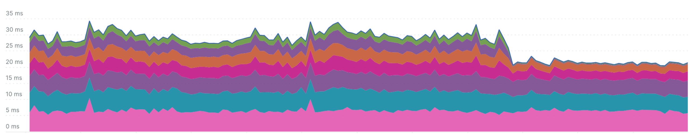
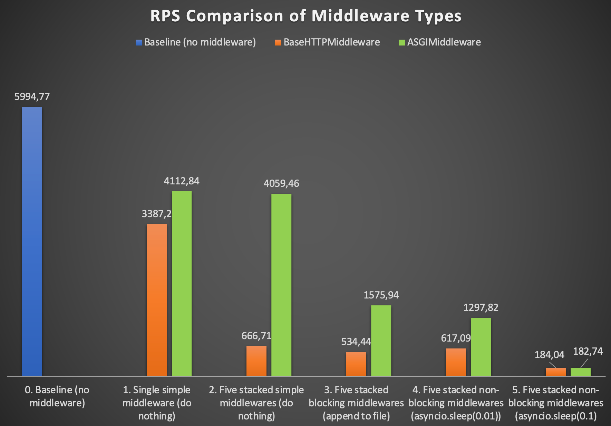

# Today I learned (TIL): Analyzing FastAPI Middleware Performance

## Introduction

FastAPI is a well-known and beloved (almost 67k⭐️ on GitHub) modern, fast, asynchronous web framework for building
APIs with Python. It is designed for ease of use and high performance, while being robust and production-ready.

My team quite enjoyed the process of developing apps with FastAPI, finding it a rewarding learning
experience. However, one learning was a bit hard: when it came to performance testing, we faced
unexpectedly low Requests Per Second (RPS) values, which prompted a deeper investigation, 
that in turn lead us to learn more about FastAPI Middlewares.

The purpose of this note is to explore the impact of BaseHTTPMiddleware and ASGIMiddleware on FastAPI application
performance and to share our learnings.

Spoiler: this is how the performance of real-life production application may change depending the type of 
middlewares we use to implement some common logic:

## Background

In FastAPI, middleware plays a crucial role in the request-response lifecycle, acting as a layer that processes requests
and responses before they reach the core application logic, or after they leave it. This functionality is pivotal for
implementing various features like authentication, data processing, request logging, and error handling.
Whenever you want to apply some common logic to request processing in more than one endpoint, you might
consider using middlewares. FastAPI (more precisely - Starlette on which FastAPI is grounded) offers two types of
middleware:

- **BaseHTTPMiddleware**: This type of middleware is designed around a simple and straightforward interface. When using
  BaseHTTPMiddleware, you define an async function that takes the request, calls the next item in the middleware chain,
  and then you can modify the response.

- **ASGIMiddleware**: ASGI (Asynchronous Server Gateway
  Interface) [specification](https://asgi.readthedocs.io/en/latest/specs/main.html#middleware) states:
  `It is possible to have ASGI “middleware” - code that plays the role of both server and application,
  taking in a scope and the send/receive awaitable callables, potentially modifying them,and then calling
  an inner application.` ASGIMiddleware functions within ASGI application, which is a core components of frameworks
  like FastAPI and Starlette. Moreover, such middleware shares the same `coroutine application(scope, receive, send)`
  signature with
  ASGI applications. Generally, implementing and supporting ASGIMiddleware is more complex than BaseHTTPMiddleware due
  to its lower level of abstraction, offering more direct interaction with the ASGI protocol. It's important to note
  that ASGIMiddleware is not subject to some of the
  important [limitations](https://www.starlette.io/middleware/#limitations) of
  BaseHTTPMiddleware.

As far as middlewares act as a layer in request-response lifecycle, they are expected to have an impact on application
performance. The question is - how much? And what is the difference between two types of middlewares supported within
FastAPI?

## The Discovery Process

During performance load testing with ApacheBench (ab) we found that although the application can handle the required RPS
it
still seems quite low for
an async application which does not contain any significant CPU-bound calls. Another point of worry, RPS didn't scale
linearly with the number of application instances. We decided to investigate the issue further.

After intensive research, we came down to reviewing our middlewares and found performance
caveats that I will illustrate with experiments below.

## Experimentation and Analysis

Here are five experiments that nicely represent the investigation process our team went through.
I will be running ApacheBench (ab) with concurrency 100 and 1000 requests against each experimental case to measure RPS
of our sample application with different middlewares. I will run each case five times and average the results.

```bash
>> ab -c 100 -n 1000 http://127.0.0.1:8000/
```

### Experiment Setup

#### Case 0: Baseline (No Middlewares)

Let's start with a simple FastAPI application that contains a single endpoint and no middlewares.

```python
from fastapi import FastAPI

app = FastAPI()


@app.get("/")
def read_root():
    return {"Hello": "World"}
```

#### Case 1: Single Simple Middleware

Here are the implementations of both types of middlewares. Both are effectively doing nothing.

```python
# BaseHTTPMiddleware
from urllib.request import Request
from starlette.middleware.base import BaseHTTPMiddleware


class HTTPMiddleware:
    async def __call__(self, request: Request, call_next):
        return await call_next(request)


app.add_middleware(BaseHTTPMiddleware, dispatch=HTTPMiddleware())

# ASGIMiddleware
from starlette.types import ASGIApp, Send, Scope, Receive


class ASGIMiddleware:
    def __init__(self, app: ASGIApp):
        self.app = app

    async def __call__(self, scope: Scope, receive: Receive, send: Send):
        await self.app(scope, receive, send)


app.add_middleware(ASGIMiddleware)
```

#### Case 2: Five Stacked Simple Middlewares

Middlewares are still doing nothing, but let's stack them up to find the impact.

```python
# BaseHTTPMiddleware
for _ in range(5):
    app.add_middleware(BaseHTTPMiddleware, dispatch=HTTPMiddleware())

# ASGIMiddleware
for _ in range(5):
    app.add_middleware(ASGIMiddleware)
```

#### Case 3: Five Stacked Blocking Middlewares

So far our tests were very synthetic. Let's try to make them more realistic by adding some logic to our middlewares.
In asynchronous application it's very important to avoid synchronous calls that block the entire event loop and may
have dramatic performance impact, but some blocking calls are unavoidable - like logging
(off topic: offloading logging to a separate thread may help minimize impact).

Let's add some massive blocking calls to our middlewares.

```python
# BaseHTTPMiddleware
class HTTPMiddleware:
    async def __call__(self, request: Request, call_next):
        with open('/tmp/middleware.log', 'a') as f:
            f.write('HTTPMiddleware\n' * 1000)
        return await call_next(request)


# ASGIMiddleware
class ASGIMiddleware:
    def __init__(self, app: ASGIApp):
        self.app = app

    async def __call__(self, scope: Scope, receive: Receive, send: Send):
        with open('/tmp/middleware.log', 'a') as f:
            f.write('ASGIMiddleware\n' * 1000)
        await self.app(scope, receive, send)
```

#### Case 4: Five Stacked Non-Blocking Middlewares

Let's see whether adding async calls to our middlewares have different impact. Here I'm including an asyncio.sleep for
10ms call to
our logic.

```python
# BaseHTTPMiddleware
class HTTPMiddleware:
    async def __call__(self, request: Request, call_next):
        await asyncio.sleep(0.01)
        return await call_next(request)


# ASGIMiddleware
class ASGIMiddleware:
    def __init__(self, app: ASGIApp):
        self.app = app

    async def __call__(self, scope: Scope, receive: Receive, send: Send):
        await asyncio.sleep(0.01)
        await self.app(scope, receive, send)
```

#### Case 5: Five Stacked Non-Blocking Middlewares with 100ms sleep

Same as previous case but with increased sleep time to 100ms - take it as a representation of a few async database or
services discovery calls,

### Results and Observations

Here is the summary of the results from the experiments above.



- Case 1: Single Simple Middleware (doing nothing)
    - Impact from adding a single middleware is pretty visible, telling us there is a noticeable
      overhead of running a middleware.
    - BaseHTTPMiddleware is ~15% slower.
- Case 2: Five Stacked Simple Middlewares (doing nothing)
    - The impact of executing five BaseHTTPMiddlewares is significant.
      RPS drops by an order of magnitude, comparing to Baseline.
    - ASGIMiddleware virtually not affected by stacking up.
- Case 3: Five Stacked Blocking Middlewares (writing to a file)
    - Heavy blocking call is not adding much impact to BaseHTTPMiddleware performance, telling us that response time is
      probably already saturated by middleware overhead.
    - Impact on ASGIMiddleware is significant, which is expected.
- Case 4: Five Stacked Non-Blocking Middlewares (asyncio.sleep(0.01))
    - BaseHTTPMiddleware with `sleep` performs just a tiny bit slower than in case 2 where middleware is doing nothing,
      this somewhat
      supports the idea that we maxed-out middleware overhead impact.
    - ASGIMiddleware still faster but to a lesser extent.
- Case 5: Five Stacked Non-Blocking Middlewares with 100ms sleep
    - Finally, middlewares of different types have gotten on par with each other.

## Findings and Recommendations

Based on experiments above BaseHTTPMiddleware has a measurable performance
overhead comparing to ASGIMiddleware. The shorter the processing time of a middleware logic, the more significant the
difference in performance between the two types of middlewares will be.
 
It looks, this overhead comes from [anyio](https://anyio.readthedocs.io/en/stable/index.html) task management routines 
used by Starlette to handle middlewares.


[**BaseHTTPMiddleware**](https://github.com/encode/starlette/blob/master/starlette/middleware/base.py#L94)
class provides a nice and simple abstraction to user. By giving the immediate access to the `Request` it makes
development and support of middlewares effortless and cost-effective. At the same time, abstraction comes at a cost of
overhead (task execution, exception and stream management through anyio library).

**ASGIMiddleware** in turn is way more involving to implement and maintain.
Actually it forces you drop down abstraction to the level of ASGI protocol. It steepens the learning curve and raises
the requirements to testing and quality assurance, but may bring reasonable performance benefit.

Here is how a real-life impact of migration from BaseHTTPMiddleware to ASGIMiddleware looks like (optimized middlewares
are marked with arrows) - 20%-30% improvement in request processing time in a single endpoint.


Even the performance benefit looks impressive, as it happens often - it's a tradeoff with complexity. Unless you heavily relay on
multiple stacked middlewares for you business logic, I would not suggest to use ASGIMiddleware before RPS and/or request
processing time requirements will force you to. But it's important to keep this option under the belt and use it when
other more obvious optimizations opportunities are exhausted.

## Conclusion

FastAPI middlewares are a powerful tool for implementing various features like authentication, CORS handling, logging,
adding custom metrics and many more. However, overhead of middleware execution may be significant and should be taken
into account while sizing an application. I strongly suggest avoiding the premature optimization and keeping the design
as simple as possible which helps to increase Time to Market and reduce maintenance costs. While, if requirements
force you to optimize - migrating to ASGIMiddleware might be a good option to consider.

## References and Further Reading

- FastAPI documentation on middleware: https://fastapi.tiangolo.com/tutorial/middleware/ and ASGI
  Middlewares https://fastapi.tiangolo.com/advanced/middleware/
- Starlette documentation on middleware: https://www.starlette.io/middleware/
- Discussion at FastAPI github: https://github.com/tiangolo/fastapi/issues/2696
- Another experiment on the topic https://kisspeter.github.io/fastapi-performance-optimization/middleware
