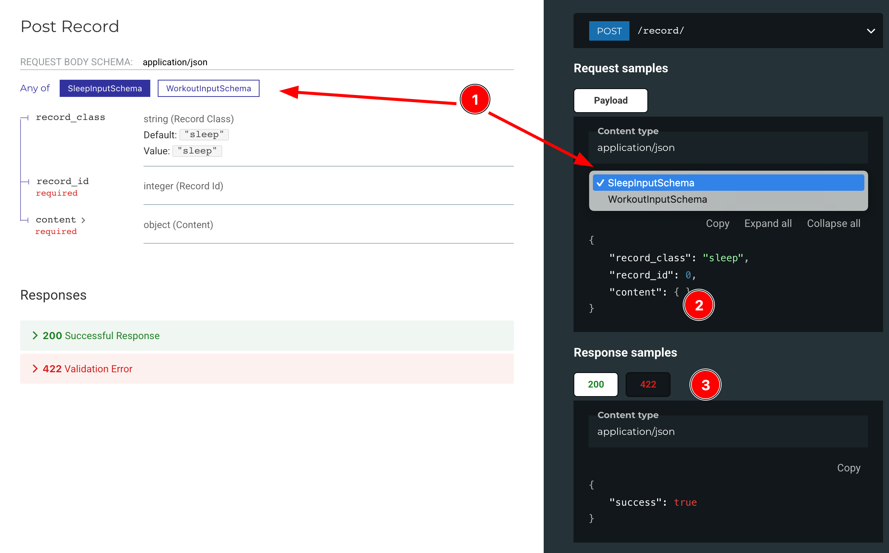
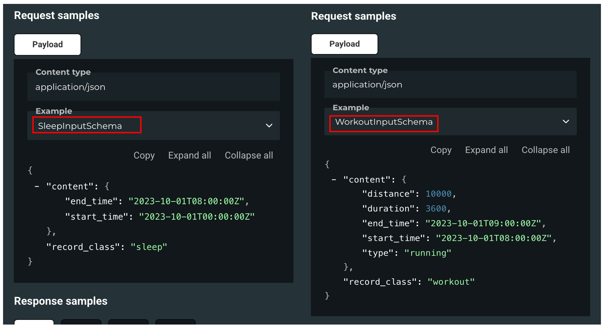
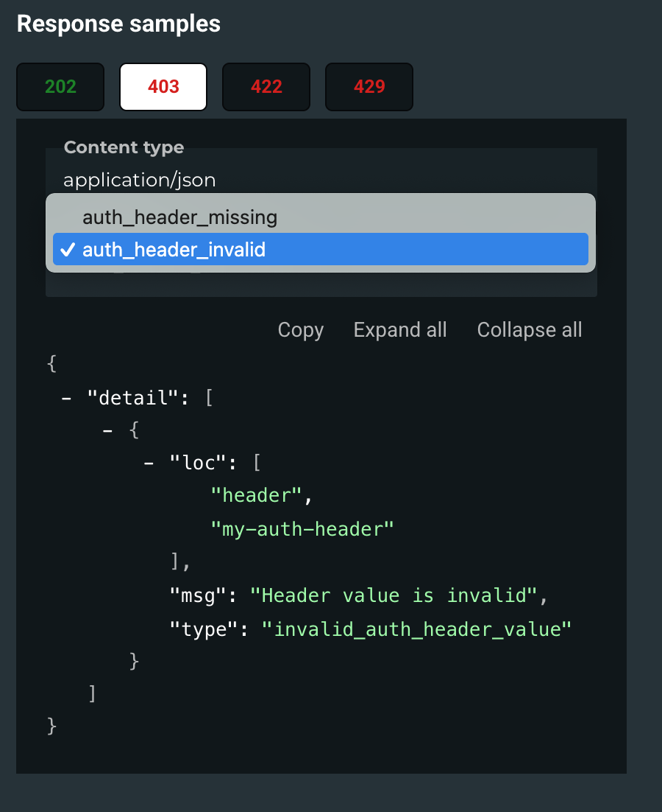

# Documenting and unit-testing APIs with the client in mind

> "Write once, use everywhere: How shared examples made our API docs bulletproof."


This is going to be a series of articles describing my team's approach to

- documenting APIs in a way it's useful and easy to understand for the client
- how we make 100% sure the documentation is correct and never gets outdated
- how we ensure interfaces (or otherwise API contracts) never get broken

In fact, this is about how we made ourselves fearless about changing the API and refactoring the code
while strictly maintaining the API contract.

The series will be structured as follows:

1. Documenting APIs and making sure the documentation is always up-to-date (this article)
2. Testing API side effects:
    1. AWS Serverless backend (SQS, SNS, Lambda, DynamoDB, S3, you name it)
    2. PostgreSQL as storage backend
    3. redis/valkey caching
3. Testing API: load testing

In this article I will focus on documenting the API and making sure the documentation is always up-to-date.

> TL;DR: This article shows how our team solved a common business problem: maintaining reliable API documentation that
> clients can trust. Our approach saves developer time, reduces client frustration, and prevents production issues by
> ensuring documentation and API behavior stay in perfect sync. 
> 
> The core of the approach is use of shared request and
> response payload examples for documentation and testing, and sometimes for behavior implementation. This creates a
> fail-safe system where changes to the API automatically flag outdated documentation. This gives our team
> confidence to refactor and evolve our codebase without breaking client integrations, ultimately delivering more value
> faster with fewer bugs.

## Documenting the API

### Basic API

Let's start with very basic FastAPI-based API with a single endpoint that supposed to process various payloads POSTed
by client.

First, I declare a couple of Pydantic models that will be used to validate the payloads,
and to produce the response.

```python
# main.py

class SleepInputSchema(BaseModel):
    record_class: Literal["sleep"] = "sleep"
    record_id: int  # for the sake of example
    content: dict


class WorkoutInputSchema(BaseModel):
    record_class: Literal["workout"] = "workout"
    record_id: int  # for the sake of example
    content: dict


class SuccessResponseSchema(BaseModel):
    success: bool = True
```

Then, I declare the API endpoint, that validates the payload, rate-limits the request, checks for authorization
and if above are ok, processes the payload and responds to client.
> In real application, I will rather use middleware for rate-limiting, and possible dependency for auth check, but
> for the sake of simplicity, I will weirdly simulate them here.

```python
# main.py

@app.post("/record/")
def post_record(request: Request, response: Response,
                payload: SleepInputSchema | WorkoutInputSchema = Body(...), ) -> SuccessResponseSchema:
    raise_on_rate_limit_exceeded(request)  # Simulate a rate limit. Will raise 429 HTTPException

    # Simulate auth check
    # Will raise 403 HTTPException with different body depending on 
    # whether the header is missing or secret token is invalid
    raise_on_unauthorized(request)

    do_something_with_payload(payload)  # Simulate some processing

    # Return a success response
    response.status_code = status.HTTP_202_ACCEPTED
    return SuccessResponseSchema()
```

Simple and straightforward API, right? But let's take a look at the API documentation generated by FastAPI.
> I'm using the ReDoc API documentation for illustration as I find it more readable than Swagger UI.
> In FastAPI ReDoc documentation by default is available at `/redoc` uri in opposition to `/docs` for Swagger UI.




(1) First of all we have both payload schemas (SleepInputSchema and WorkoutInputSchema) represented in Samples part
of the documentation. FastAPI does a great job providing us with somewhat "workable" values for the payload fields in
Sample part of the documentation, though being synthetic they are not helping to understand the business sense of the
payload.

(2) In out example we have weakly-annotated field `content` in the payload. Documentation gives us very little sense
of what the content may be.

> In real life I would as moch as possible avoid such weak annotations.
> I will also extensively exercise `description`, `constraints` and
> other features of the [Pydantic Fields](https://docs.pydantic.dev/latest/concepts/fields/) as a means to help client
> better understand the fields nature and context (and to foster stricter validation as well).

(3) On the responses side I see few issues:

- default response code is 200 OK, which is not correct. Our API returns 202 Accepted on success.
- missing possible 403 Forbidden that our endpoint may return with two different bodies depending on whether the auth
  header is missing or
  the token is invalid.
    - auth schema in our example app is very wierd, so it does not even document the need for a auth header. I will not
      bother
      to fix this for the sake of brevity.
- missing 429 Too Many Requests that endpoint may return if the rate limit is exceeded.

Without proper documentation, those 403 and especially 429 responses may come as a surprise for a client.
In worse case - in production.

### Fixing API documentation

First, let's create an examples package that will contain all example payloads and responses.

```python
# examples/inputs.py

SLEEP_INPUT_EXAMPLE = {"record_class": "sleep", "record_id": 123,
                       "content": {"start_time": "2023-10-01T00:00:00Z", "end_time": "2023-10-01T08:00:00Z", }, }

WORKOUT_INPUT_EXAMPLE = {"record_class": "workout", "record_id": 123,
                         "content": {"start_time": "2023-10-01T08:00:00Z", "end_time": "2023-10-01T09:00:00Z",
                                     "type": "running", "duration": 3600, "distance": 10000, }, }

# examples/responses.py

SUCCESS_RESPONSE_EXAMPLE = {"success": True}

RATE_LIMIT_EXCEEDED_RESPONSE_EXAMPLE = {
    "detail": [{"loc": ["rate_limiter"], "msg": "Retry in 15 minutes", "type": "rate_limit_exceeded", }]}

AUTH_HEADER_MISSING_RESPONSE_EXAMPLE = {
    "detail": [{"loc": ["header", "my-auth-header"], "msg": "Header is required", "type": "missing_header", }]}

AUTH_HEADER_INVALID_RESPONSE_EXAMPLE = {"detail": [
    {"loc": ["header", "my-auth-header"], "msg": "Header value is invalid", "type": "invalid_auth_header_value", }]}

RESPONSE_EXAMPLES = {202: {"description": "Success", "content": {
    "application/json": {"examples": {"success": {"value": SUCCESS_RESPONSE_EXAMPLE}, }}}, },
                     403: {"description": "Failure", "content": {"application/json": {
                         "examples": {"auth_header_missing": {"value": AUTH_HEADER_MISSING_RESPONSE_EXAMPLE},
                                      "auth_header_invalid": {"value": AUTH_HEADER_INVALID_RESPONSE_EXAMPLE}, }, }}, },
                     429: {"description": "Rate limit exceeded", "content": {"application/json": {
                         "examples": {"rate_limit_exceeded": {"value": RATE_LIMIT_EXCEEDED_RESPONSE_EXAMPLE}}, }}, }, }
```

Now let's update our schemas to carry those examples.

```python
class SleepInputSchema(BaseModel):
    ...  # same as before
    model_config = {"json_schema_extra": {"examples": [SLEEP_INPUT_EXAMPLE]}}


class WorkoutInputSchema(BaseModel):
    ...  # same as before
    model_config = {"json_schema_extra": {"examples": [WORKOUT_INPUT_EXAMPLE]}}


class SuccessResponseSchema(BaseModel):
    ...  # same as before
    model_config = {"json_schema_extra": {"examples": [SUCCESS_RESPONSE_EXAMPLE]}}
```

And now we can fix the API

```python
@app.post("/record/", status_code=status.HTTP_202_ACCEPTED, responses=RESPONSE_EXAMPLES, )
def post_record(request: Request, response: Response,
                payload: SleepInputSchema | WorkoutInputSchema = Body(...), ) -> SuccessResponseSchema:
    ...  # same as before
```

Let's see if our documentation improved?
In fact, it did!

Now we have sensible examples of both payloads that help us understand the business context.
> I deliberately put a huge and messy code block with examples below to illustrate the concept, but also to give a
> sense, that this may quickly grow into a huge mess - I'll touch on this in conclusion.




Also, we have proper response codes and examples (including two different 403 response bodies).

## Testing the API

Now that we have a well-documented API with clear examples, let's take the next logical step: ensuring this
documentation never becomes outdated or inaccurate. The key insight of our approach is using the exact same examples for
both documentation and testing, creating a powerful feedback loop. Any time our API behavior changes in a way that would
invalidate our documentation, our tests will immediately fail - giving us an early warning system for breaking changes.

I will start with setting up a basic test framework.

```python
# test/conftest.py

import os
import pytest
from fastapi import FastAPI
from starlette.testclient import TestClient


@pytest.fixture()
def test_client(test_app: FastAPI):
    with TestClient(test_app) as c:
        yield c


@pytest.fixture()
def test_app(set_default_environ):
    from app.main import app
    yield app


@pytest.fixture(autouse=True, scope="session")
def set_default_environ():
    os.environ["SECRET_TOKEN"] = "secret_1"
```

Then I would write tests that effectively freeze the API contract.

Let's start with the happy path. The below test will make sure that payloads that we used to generate the documentation
will always pass the validation and be accepted by the API, returning expected response.

```python
# test/test_post_endpoint.py
# happy path
@pytest.mark.parametrize("input_payload", (SLEEP_INPUT_EXAMPLE, WORKOUT_INPUT_EXAMPLE))
def test_post_endpoint_success(input_payload, test_client):
    response = test_client.post("/record/", json=input_payload, headers={"my-auth-header": "secret_1"}, )
    assert response.status_code == 202
    assert response.json() == SUCCESS_RESPONSE_EXAMPLE
```    

Now let's test the rate limiter. Below test will make sure that in case of rate limit exceeded, the API will return
exactly the same response as we used to generate the documentation.

```python
# test/test_post_endpoint.py
# error 429 path
def test_post_endpoint_rate_limit_exceeded(test_client):
    response = test_client.post("/record/", json=SLEEP_INPUT_EXAMPLE,
                                headers={"my-auth-header": "secret_1", "X-RateLimit-Remaining": "0", }, )
    assert response.status_code == 429
    assert response.json() == RATE_LIMIT_EXCEEDED_RESPONSE_EXAMPLE
```

Finally let's test the authorization. The below test will not only ensure our "wierd" authorization effectively works,
but also that the API responses are inline with the documentation.

```python  
# test/test_post_endpoint.py
# error 429 path
@pytest.mark.parametrize("headers, expected_response",
                         [({"my-auth-header": "wrong_value"}, AUTH_HEADER_INVALID_RESPONSE_EXAMPLE,),
                          ({"invalid-header": "secret_1"}, AUTH_HEADER_MISSING_RESPONSE_EXAMPLE,), ], )
def test_post_endpoint_forbidden(headers, expected_response, test_client):
    response = test_client.post("/record/", json=SLEEP_INPUT_EXAMPLE, headers=headers, )
    assert response.status_code == 403
    assert response.json() == expected_response
```

**Let's do a little recap of what we did so far:**

1. We created a set of examples for both payloads and responses.
2. We made payload and response schemas to carry payload examples with them to ensure it's used in OpenAPI schema
   generation.
3. I didn't show my `raise_on_***` functions code, but they also use same examples to generate the response body. This
   ensures DRY'er code.
4. Test suite uses our examples to test the API contract and "freeze" the API interface.

This very simple test framework along with documentation examples provides us with a very strong guarantee that
API contrat will stay and the documentation will be up-to-date. But not only: there are other beneficial side effects
of the approach - let's consolidate all the benefits.

## Conclusion

- We have **fixed** in stone **the API contract end-to-end**: from documentation to the behaviour covered with test.
    - Evolution of input models will inevitably trigger a failed test, reminding us to updates the examples - hence the
      documentation.
    - Any change in response model will also remind us to update the examples and the documentation by failing the test.
    - Whatever we shared with client through the documentation is tested and guaranteed to be correct.
    - We may add as many examples as we want to share more business context with client and have deeper test coverage of
      various payloads.
- **Client may use Samples form ReDoc to test the API** and more importantly, **to have handy test cases for their own
  tests.**
- As we managed to "freeze" the interface - we open the door for **fearless refactoring**: unwanted documentation or
  behaviour changes
  will immediately emerge as test failures.
- Test suite contains zero mocking, so we have honest code coverage and **simplified refactoring**.
    - In real life I expect some mocking is inevitable, but if kept to a minimum and done properly - should not impede
      the
      refactoring. I will discuss more on this in the next article.
- Overall the approach is very handy for **Test Driven Development** -> start with the documentation (examples), write
  failing test and go ahead to implement the API.

I want to point out one of important side effects: **debugging such API is a breeze** 💨. More realistic APIs would
have more complex payloads and business logic. But whenever the bug is found (it's not too often with our testing
rigour),
I just dump the failing payload into the test, put a breakpoint and will find the root-cause immediately. And after
issue
is fixed - I make sure to keep this payload in my test suite to avoid regress.

This all looks fascinating, but what are the challenges? I see a few

- If a new input models added - there's noting to prevent us from forgetting to add the examples and tests.
    - We rely on Code Review process to avoid blind spots in test suite, but I can envision a linter that might help
      here.
- Keeping the documentation updated and tested while making changes takes time. Especially if your API is a gateway to
  asynchronous processing engine (AWS Lambda, Celery workers, etc.) - you may face the need to update a lot of examples
  throughout the codebase of the application. But I will argue that confidence in the API contract worth the time.
- Examples dictionary looks a bit scary if not messy. This may be (and my team did that) fixed by some wrappers to
  generate
  examples in runtime from simpler datastructures.
- Growing variety of payloads and responses make path-function signature gigantic - this can be fixed with aliases
  and/or Unions.

In the next article, I'll expand on these concepts by diving into testing API side effects. We'll explore how to
maintain the same level of contract certainty when your API interacts with external systems like AWS services (SQS, SNS,
Lambda, DynamoDB, S3), PostgreSQL databases, and caching layers. I'll show how we handle these more complex
scenarios while keeping our tests fast, reliable, preventing regressions and fostering refactoring. Stay tuned if
you're curious about testing asynchronous processes or managing test databases without sacrificing test speed or
coverage!

Drop a comment or reach out - I'm always happy to geek out about making sustainable and reliable solutions!
